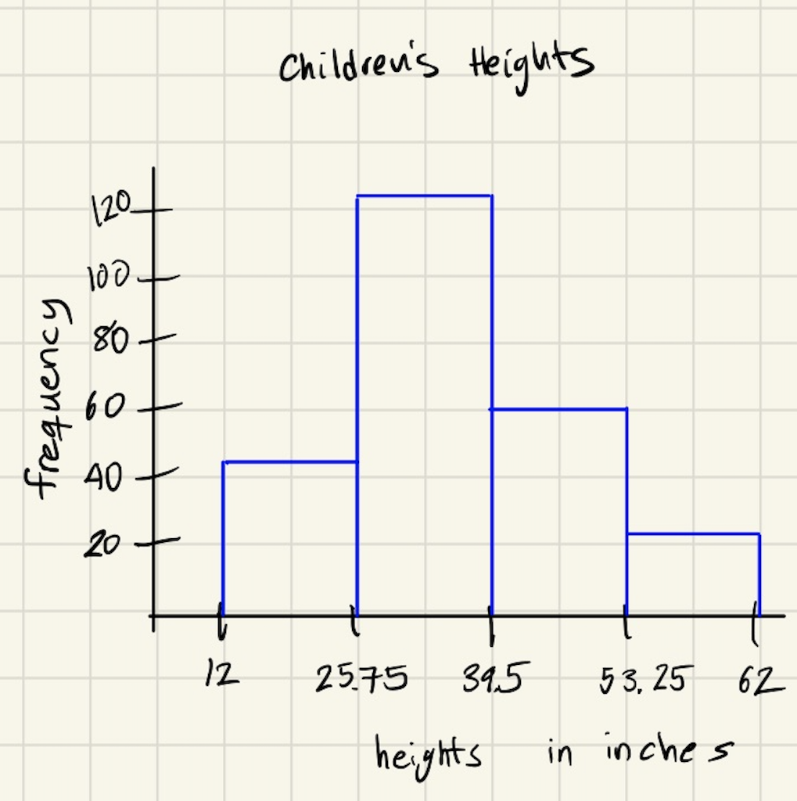
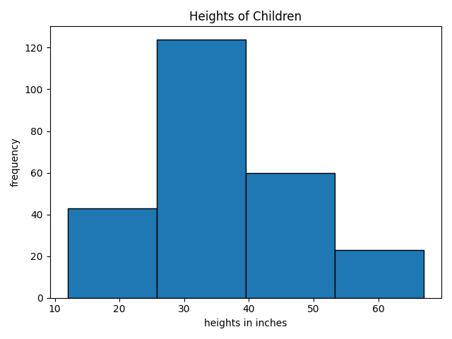

# Histogram

A ***histogram*** is a way to visualize the values of a quantitative variable for a large group of observational units.  One axis of a histogram shows the quantitative variable, and is chopped up into intervals.  You then count how many data values appear in each interval.  The other axis displays these counts.  A box is drawn based at each interval, with length indicating the number of observations in that interval.  

## Example - By Hand
In this example we'll see how to construct a histogram from a data set*.  The observational units for this data set are 250 children in the United States, the variables are the age (in months), weight (in pounds), height (in inches) and gender (recorded as M or F). Because this data set is large, the table below shows only the first few lines of data.  [Click here to see the full data set.](../data/kid-weights-UsingR.csv)

| age | weight | height | gender |
|-----|--------|--------|--------|
| 58  | 38     | 38     | M      |
| 103 | 87     | 43     | M      |
| 87  | 50     | 48     | M      |
| 138 | 98     | 61     | M      |
| 82  | 47     | 47     | F      |

 We will focus only on the height variable in this example. 

 To build a histogram for the height variable, we first decide how to chop the axis recording heights into subintervals.  Usually people call the subintervals ***bins***, so we are creating the bins for our histogram.  For simplicity we'll use 4 bins for this example.  The highest height in the data set is 67 inches and the lowest is 12 inches (data entry error?).  We subtract the lowest from the heighest, and divide that number by the number of bins.  What we get is the length of the bins that we'll use in the histogram.
 
=13.75)

To get the bins we start with the minimum value of 12 and add the bin width of 13.75, repeating until we reach the maximum value of 67.


So the bins are 12 to 25.75, 25.75 to 39.5, 39.5 to 53.25, and 53.25 to 67.

Next we count up the number of data values that fall into each of these bins. For data values that fall exactly on the edge on an interval, you have to decide to put them in the interval to the right or to the left.  Just apply the choice consistently for all data values. From these counts we form a frequency table.  The frequency table is given below.  The number 43 in the table indicates that 43 data values fell between 12 and 25.75.


| bin | 12 to 25.75      | 25.75 to 39.5  | 39.5 to 53.25      | 53.25 to 67 |
|----------|--------------|----------|--------------|--------------|
| # data values in bin   | 43     | 124    | 60   | 23 |

Finally we can draw the histogram with the length of the box over each interval given by the number in the frequency table.





## Example - Using `matplotlib.pyplot`

By using the `matplotlib.pyplot` library, we can use Python to automatically create a histogram of numbers in a list.  The histogram below was created using this method. The code that produced this histogram appears below the histogram. The key line of code is `plt.hist(heights, edgecolor='black', bins=4)`.  You provide the list of data (`heights`), and the number of bins (`bins=4`). To get lines around the rectangles in the plot we've included (`edgecolor='black'`).

<!-- (Comment) Code for graph below is in level_1/code/hist.py -->


```python
import matplotlib.pyplot as plt

heights = [38, 43, 48, 61, 47, 24, 29, 48, 59, 24, 40, 27, 26, 29, 29, 28, 59, 28, 30, 24, 36, 36, 47, 48, 33, 23, 28,
           25, 35, 34, 32, 25, 40, 23, 33, 36, 36, 40, 31, 39, 41, 33, 58, 53, 31, 23, 33, 34, 36, 21, 48, 38, 36, 12,
           27, 24, 24, 36, 36, 26, 38, 40, 24, 28, 36, 30, 27, 24, 41, 33, 45, 30, 58, 48, 26, 36, 25, 32, 23, 40, 24,
           25, 27, 28, 37, 26, 25, 46, 38, 31, 30, 52, 23, 24, 53, 48, 36, 32, 36, 24, 29, 28, 54, 36, 50, 42, 34, 55,
           30, 34, 39, 37, 24, 22, 58, 35, 38, 30, 45, 48, 46, 47, 32, 35, 24, 49, 48, 40, 28, 32, 28, 22, 40, 38, 32,
           29, 33, 53, 54, 48, 37, 31, 28, 38, 54, 24, 43, 50, 61, 30, 61, 47, 40, 48, 33, 38, 30, 59, 42, 48, 36, 26,
           67, 29, 24, 41, 38, 36, 34, 31, 36, 51, 23, 50, 26, 39, 30, 58, 35, 50, 60, 42, 47, 43, 36, 24, 24, 38, 27,
           48, 34, 50, 25, 24, 26, 23, 39, 45, 26, 42, 33, 31, 41, 54, 51, 34, 59, 23, 23, 56, 58, 36, 24, 58, 52, 34,
           22, 36, 24, 22, 29, 31, 23, 36, 43, 33, 22, 49, 39, 28, 36, 39, 61, 39, 30, 36, 36, 26, 29, 45, 32, 43, 36,
           56, 40, 27, 25, 33, 40, 27]
           
plt.hist(heights, edgecolor='black', bins=4)
plt.ylabel('frequency')
plt.xlabel('heights in inches')
plt.title('Heights of Children')
plt.tight_layout()
plt.show()
```

\* All data comes from somewhere, and it's important to give credit to the source. This also allows the reader to think critically about how the source of the data might influence their understanding of the data. The data is from the [National Center for Health Statistics](https://www.cdc.gov/nchs/nhanes/index.htm?CDC_AA_refVal=https%3A%2F%2Fwww.cdc.gov%2Fnchs%2Fnhanes.htm). John Verzani at the City University of New York did the data cleaning to produce this nice data set as part of his educational project called [**UsingR**](https://www.math.csi.cuny.edu/Statistics/R/simpleR/). The decisions to use U.S. Customary Units (rather than metric), and the binary gender variables M and F, were likely made by researchers at the National Center for Health Statistics. 
