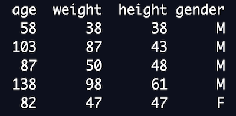

# Histogram

A ***histogram*** is a way to visualize the values of a quantitative variable for a large group of observational units.  One axis of a histogram shows the quantitative variable, and is chopped up into intervals.  You then count how many data values appear in each interval.  The other axis displays these counts.  A box is drawn based at each interval, with length indicating the number of observations in that interval.  For data values that fall exactly on the edge on an interval, you have to decide to put them in the interval to the right or to the left.  Just apply the choice consistently for all data values.

## Example
In this example we'll see how to construct a histogram from a data set*.  The observational units for this data set are 250 children in the United States, the variables are the age (in months), weight (in pounds), height (in inches) and gender (recorded as M or F). Because this data set is large, the table below only shows screen shot of the first few data values.  [Click here to see the full data set.](../data/kid-weights-UsingR.csv)

.

 We will focus only on the height variable in this example. 
 
 To build a histogram for the height variable, we first decide how to chop the axis recording heights into subintervals.  Usually people call the subintervals ***bins***, so we are creating the bins for our histogram.  For simplicity we'll use 4 bins for this example.  The highest height in the data set is 67 inches and the lowest is 12 inches (data entry error?).  We subtract the lowest from the heighest, and divide that number by the number of bins.  What we get is the length of the bins that we'll use in the histogram.
 
)=13.75" target="_blank"></a>)


| flavor  | chocolate       | strawberry  | tutti frutti       | vanilla |
|----------|--------------|----------|--------------|--------------|
| # students   | 6      | 3    | 2   | 3 |


The bar chart below lists each ice cream flavor on the horizontal axis. The vertical axis is marked off to show how often that flavor is selected as a student's favorite. The height of the bars over each flavor record how often that flavor appears as a student's favorite. The Python code used to produce the bar graph is given below the graph.

<!-- (Comment) Code for graph below is in level_1/code/bar-vert.py -->


```
import matplotlib.pyplot as plt
flavors = ["chocolate", "strawberry", "tutti frutti", "vanilla"]
frequency = [6, 3, 2, 3] 
plt.bar(flavors, frequency, align='center')
plt.ylabel('frequency')
plt.xlabel('Ice Cream Flavors')
plt.title("Favorite Ice Cream Flavors in Our Class")
plt.savefig("fig1")
```

The bar chart below shows the same thing, but the flavors appear on the vertical axis and the bars extend horizontally to indicate the frequency of each flavor in the table. The Python code used to produce the bar graph is given below the graph.

<!-- (Comment) Code for graph below is in level_1/code/bar-horiz.py -->


\* All data comes from somewhere, and it's important to give credit to the source. This also allows the reader to think critically about how the source of the data might influence their understanding of the data. The data is from the [National Center for Health Statistics](https://www.cdc.gov/nchs/nhanes/index.htm?CDC_AA_refVal=https%3A%2F%2Fwww.cdc.gov%2Fnchs%2Fnhanes.htm). John Verzani at the City University of New York did the data cleaning to produce this nice data set as part of his educational project called [**UsingR**](https://www.math.csi.cuny.edu/Statistics/R/simpleR/). The decisions to use U.S. Customary Units (rather than metric), and the binary gender variables M and F, were likely made by researchers at the National Center for Health Statistics. 
