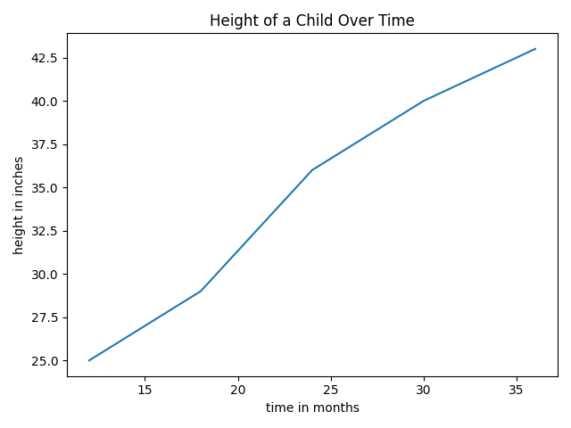

# Line Plot

A ***line plot*** is a way to visualize data using points connected with line segments.  A common use of line plots is to visualize a quantitative variable that changes over time.  Time is appears on the horizontal axis, and the variable of interest appears on the vertical axis.  

## Example
In this example the observational unit is a single child, and the variables are time (in months), and the height of the child at a given time (in inches).

| time | height | 
|-----|--------|
| 12  | 25     |
| 18 | 29     | 
| 24  | 36     | 
| 30 |   40   |
| 36  | 44     |

To make the scatter plot, scale the horizontal axis by time and the vertical axis by height. 
Once the two axis are set up, plot the data.  So we plot the points below:

 | (time, height) |
|----|
 | (12,25)     | 
| (18,29)     | 
| (24,36)     | 
 | (30,40)    | 
| (36,44)     | 

Finally, connect consecutive points in the plot. The completed line plot appears below, generated in Python using `matplotlib.pyplot`. The Python code used to produce the bar graph is given below the graph.  The key line in the code is `plt.plot(time, height)` which produces a line plot with the list that appears first plotted on the horizontal axis, and the list that appears second plotted on the vertical axis.

<!-- (Comment) Code for graph below is in level_1/code/line.py -->



```
import matplotlib.pyplot as plt

time = [12, 18, 24, 30, 36]
height = [25, 29, 36, 40, 43]

plt.plot(time, height)

plt.xlabel('time in months')
plt.ylabel('height in inches')
plt.title('Height of a Child Over Time')
plt.tight_layout()
plt.show()
```