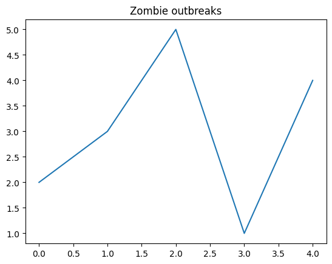

# The `matplotlib.pyplot` Library

The `matplotlib.pyplot` library provides you with enormous power for drawing graphs to visualize data. It has
a very long name because `matplotlib` has many pieces; we only need one of them. The long name would be
unwieldy, so it is traditional to give it the nickname `plt` when importing it:

```python
import matplotlib.pyplot as plt
```

A program to draw a graph generally has the following parts:

1. `import matplotlib.pyplot as plt`
1. Prepare the data
1. Create the graph
1. Decorate the graph
1. Display the graph

Here's a simple example:

<!-- simple_graph.py -->
```python
import matplotlib.pyplot as plt
data = [2, 3, 5, 1, 4]
plt.plot(data)
plt.title('Zombie outbreaks')
plt.show()
```

Here is the graph produced:



## Preparing the Data

This depends heavily on the data you're working with. You will often spend almost all of your time writing this part.
For early examples, we will use simple lists.

## Creating the Graph

This depends on the type of graph you're trying to produce. Each type is described in a separate page of the *Liber
Pythonis*. The graph is not actually displayed until the final step.

## Decorating the Graph

There are many options here, but here are the most common ones:

`plt.title` takes a string and shows it at the top of the graph.

`plt.xticks` takes a list of numbers, specifying the locations of the little marks along the horizontal (x) axis.

`plt.yticks` is similar, but for the vertical (y) axis.

`plt.xlabel` takes a string and shows it below the horizontal axis, indicating what this axis means.

`plt.ylabel` is similar, but for the vertical (y) axis.

## Displaying the Graph

There are two ways to do this:

`plt.show()` displays the graph on your screen.

`plt.savefig('filename.png', bbox_inches='tight')` saves the graph in a file called `filename.png`. Of course, you can
change the name of the file. The named argument `bbox_inches='tight'` prevents the saved image from either cutting
off part of the graph or leaving excess white space around it.

## Multiple Plots

To plot multiple lines on the same graph, just call `plt.plot` multiple times.

If you want to create multiple independent graphs in the same program, call `plt.clf()` after displaying one graph but
before creating the next one.

## Further Reading

[`matplotlib` gallery, with many examples](https://matplotlib.org/3.1.1/gallery/index.html)
