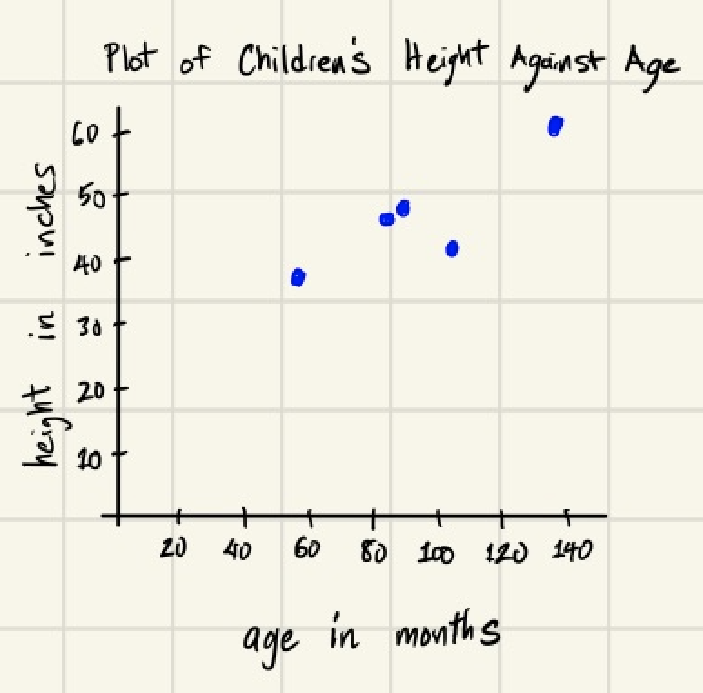

# Scatter Plot

A scatter plot is used to display the relationship between two quantitative variables when those variables describe the same observational units.  One axis of the scatter plot displays values of the one of the variables, and the other axis displays values of the other variable.  Data are plotted as ordered pairs:

`(horizontal data value, vertical data value)`.

## Example - By Hand
In this example the observational units are 250 children.  We will focus on two quantitative variables describing the children: the first is their age, in months, and the second variable is their height, in inches.  Because this data set is large, the table below shows only the first few lines of data.  [Click here to see the full data set.](../data/kid-weights-UsingR.csv)

| age | weight | height | gender |
|-----|--------|--------|--------|
| 58  | 38     | 38     | M      |
| 103 | 87     | 43     | M      |
| 87  | 50     | 48     | M      |
| 138 | 98     | 61     | M      |
| 82  | 47     | 47     | F      |

To make the scatter plot, scale each axis according to one of the two variables.  In general, it doesn't matter which variable goes on the horizontal axis and which variable goes on the vertical axis. However, if one of the variables appears to predict changes in the other variable, put the predictive variable on the horizontal axis.  

In this example it is reasonable to expect children to get taller as they get older. So we choose to put age on the horizontal axis and height on the vertical axis.

Once the two axis are set up, plot the data.  So we plot the points below:

 | (age, height) 
|----------------|
 | (58,38)     | 
| (103,43)     | 
| (87,48)     | 
 | (138,61)     | 
| (82,47)     | 





## Example - Using `matplotlib.pyplot`

By using the `matplotlib.pyplot` library, we can use Python to automatically create a scatter plot of two lists of numbers.  The scatter plot below was created using this method. The code that produced this scatter plot appears below the scatter plot. The key line of code is `plt.scatter(ages,heights)`.  You provide the two lists of data (`ages`) and (`heights`). The list that appears first is plotted on the horizontal axis, and the list that appears second is plotted on the vertical axis.


<!-- (Comment) Code for graph below is in level_1/code/scatter.py -->

```python
import matplotlib.pyplot as plt

ages = [58, 103, 87, 138, 82, 52, 28, 79, 107, 45, 58, 6, 7, 3, 8, 11, 128, 11, 14, 11, 52, 52, 64, 107, 44, 4, 6, 5, 
        35, 35, 46, 6, 34, 5, 12, 62, 70, 60, 22, 65, 51, 18, 139, 124, 7, 5, 28, 25, 43, 8, 84, 48, 63, 4, 10, 26, 59,
        23, 33, 16, 39, 56, 23, 8, 63, 41, 8, 7, 48, 104, 49, 15, 130, 111, 7, 73, 5, 37, 3, 61, 30, 4, 8, 4, 48, 18, 9,
        78, 72, 33, 5, 77, 5, 44, 64, 73, 36, 22, 55, 3, 11, 8, 124, 50, 117, 69, 39, 141, 42, 71, 55, 39, 7, 7, 111,
        36, 33, 23, 96, 79, 71, 65, 14, 45, 20, 65, 46, 60, 13, 14, 8, 4, 48, 68, 29, 7, 19, 108, 131, 75, 20, 21, 7,
        41, 113, 3, 73, 77, 130, 10, 142, 69, 21, 91, 27, 38, 15, 133, 61, 66, 78, 5, 139, 42, 40, 98, 36, 34, 19, 26,
        60, 78, 3, 74, 7, 39, 31, 126, 31, 142, 144, 47, 83, 61, 56, 6, 15, 36, 3, 67, 27, 101, 3, 3, 31, 5, 44, 101, 5,
        87, 18, 17, 46, 115, 94, 22, 126, 16, 4, 143, 130, 31, 3, 139, 105, 25, 12, 47, 5, 5, 11, 22, 10, 46, 53, 49, 3,
        125, 51, 8, 14, 39, 129, 60, 53, 40, 25, 26, 26, 74, 12, 69, 126, 113, 64, 10, 5, 23, 122, 5]

heights = [38, 43, 48, 61, 47, 24, 29, 48, 59, 24, 40, 27, 26, 29, 29, 28, 59, 28, 30, 24, 36, 36, 47, 48, 33, 23, 28,
           25, 35, 34, 32, 25, 40, 23, 33, 36, 36, 40, 31, 39, 41, 33, 58, 53, 31, 23, 33, 34, 36, 21, 48, 38, 36, 12,
           27, 24, 24, 36, 36, 26, 38, 40, 24, 28, 36, 30, 27, 24, 41, 33, 45, 30, 58, 48, 26, 36, 25, 32, 23, 40, 24,
           25, 27, 28, 37, 26, 25, 46, 38, 31, 30, 52, 23, 24, 53, 48, 36, 32, 36, 24, 29, 28, 54, 36, 50, 42, 34, 55,
           30, 34, 39, 37, 24, 22, 58, 35, 38, 30, 45, 48, 46, 47, 32, 35, 24, 49, 48, 40, 28, 32, 28, 22, 40, 38, 32,
           29, 33, 53, 54, 48, 37, 31, 28, 38, 54, 24, 43, 50, 61, 30, 61, 47, 40, 48, 33, 38, 30, 59, 42, 48, 36, 26,
           67, 29, 24, 41, 38, 36, 34, 31, 36, 51, 23, 50, 26, 39, 30, 58, 35, 50, 60, 42, 47, 43, 36, 24, 24, 38, 27,
           48, 34, 50, 25, 24, 26, 23, 39, 45, 26, 42, 33, 31, 41, 54, 51, 34, 59, 23, 23, 56, 58, 36, 24, 58, 52, 34,
           22, 36, 24, 22, 29, 31, 23, 36, 43, 33, 22, 49, 39, 28, 36, 39, 61, 39, 30, 36, 36, 26, 29, 45, 32, 43, 36,
           56, 40, 27, 25, 33, 40, 27]

plt.scatter(ages,heights)
plt.ylabel('height in inches')
plt.xlabel('age in months')
plt.title("Plot of Children's Height Against Age")
plt.tight_layout()
plt.savefig('scatter.png')
```
