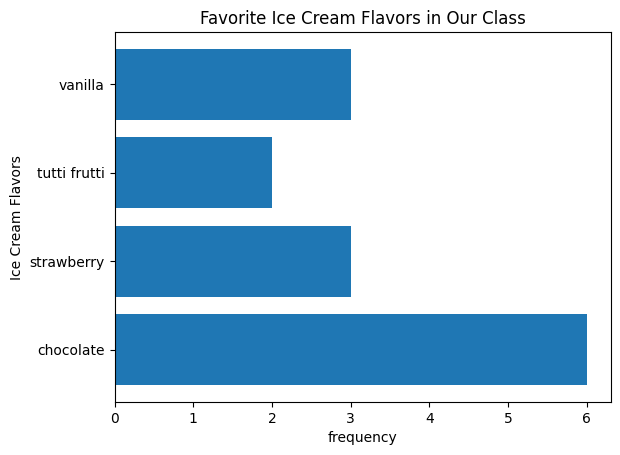

# Bar Chart

A bar chart is a way to visualize data using rectangles that are called bars.  One axis of the bar chart lists the categories of some categorical variable. The other axis is scaled to represent a quantitative variable.  There is one bar based at each category and its width or height is given by the value of the quantitative variable for that category.

## Example
A common use of bar charts is to display how often (the frequency) of the values of a categorical variable for some group of observational units.  Suppose a class has fourteen students and the table below records their favorite type of ice cream. 

| flavor  | chocolate       | strawberry  | tutti frutti       | vanilla |
|----------|--------------|----------|--------------|--------------|
| # students   | 6      | 3    | 2   | 3 |


The bar chart below lists each ice cream flavor on the horizontal axis. The vertical axis is marked off to show how often that flavor is selected as a student's favorite. The height of the bars over each flavor record how often that flavor appears as a student's favorite. The Python code used to produce the bar graph is given below the graph.

<!-- (Comment) Code for graph below is in level_1/code/bar_vert.py -->


```
import matplotlib.pyplot as plt
flavors = ["chocolate", "strawberry", "tutti frutti", "vanilla"]
frequency = [6, 3, 2, 3] 
plt.bar(flavors, frequency, align='center')
plt.ylabel('frequency')
plt.xlabel('Ice Cream Flavors')
plt.title("Favorite Ice Cream Flavors in Our Class")
plt.savefig("fig1")
```

The bar chart below shows the same thing, but the flavors appear on the vertical axis and the bars extend horizontally to indicate the frequency of each flavor in the table. The Python code used to produce the bar graph is given below the graph.

<!-- (Comment) Code for graph below is in level_1/code/bar-horiz.py -->


```
import matplotlib.pyplot as plt
flavors = ["chocolate", "strawberry", "tutti frutti", "vanilla"]
frequency = [6, 3, 2, 3] 

# To get horizontal bars, use "plt.barh" instead of "plt.bar".
# The "bbox_inches="tight" prevents the labels from being cut off of the image.

plt.barh(flavors, frequency, align='center')
plt.ylabel('Ice Cream Flavors')
plt.xlabel('frequency')
plt.title("Favorite Ice Cream Flavors in Our Class")
plt.savefig("fig1",bbox_inches="tight")
```
