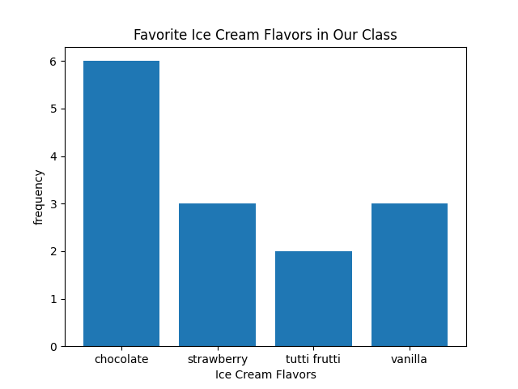

# Scatter Plot

A scatter plot is used to display the relationship between two quantitative variables when those variables describe the same observational units.  One axis of the scatterplot displays values of the one of the variables, and the other axis displays values of the other variable.  Data a plotted as ordered pairs:
`(horizontal data value, vertical data value)`.

## Example - By Hand
In this example the observational are 250 children.  We will focus on two quantitative variables describing the children: the first is their weight, in pounds, and the second variable is their height, in inches.  Because this data set is large, the table below shows only the first few lines of data.  [Click here to see the full data set.](../data/kid-weights-UsingR.csv)

| age | weight | height | gender |
|-----|--------|--------|--------|
| 58  | 38     | 38     | M      |
| 103 | 87     | 43     | M      |
| 87  | 50     | 48     | M      |
| 138 | 98     | 61     | M      |
| 82  | 47     | 47     | F      |

To make the scatter plot, scale each axis according to one of the two variables.  In general, it doesn't matter which variable goes on the horizontal axis and which variable goes on the vertical axis. However, if one of the variables appears to predict changes in the other variable, put the predictive variable on the horizontal axis.  

In this example there is no clear predictive relationship between weight and height (at least in your instructor's opinion).  So we just make a choice to put weight on the horizontal axis and height on the vertical axis.

Once the two axis are set up, plot the data.  So we plot the points below

 | (weight, height) 
|----------------|
 | (38,38)     | 
| (87,43)     | 
| (50,48)     | 
 | (98,61)     | 
| (47,47)     | 

<!-- (Comment) Code for graph below is in level_1/code/bar_vert.py -->


```
import matplotlib.pyplot as plt
flavors = ["chocolate", "strawberry", "tutti frutti", "vanilla"]
frequency = [6, 3, 2, 3] 
plt.bar(flavors, frequency, align='center')
plt.ylabel('frequency')
plt.xlabel('Ice Cream Flavors')
plt.title("Favorite Ice Cream Flavors in Our Class")
plt.savefig("fig1")
```

The bar chart below shows the same thing, but the flavors appear on the vertical axis and the bars extend horizontally to indicate the frequency of each flavor in the table. The Python code used to produce the bar graph is given below the graph.

<!-- (Comment) Code for graph below is in level_1/code/bar-horiz.py -->


```
import matplotlib.pyplot as plt
flavors = ["chocolate", "strawberry", "tutti frutti", "vanilla"]
frequency = [6, 3, 2, 3] 

# To get horizontal bars, use "plt.barh" instead of "plt.bar".
# The "bbox_inches="tight" prevents the labels from being cut off of the image.

plt.barh(flavors, frequency, align='center')
plt.ylabel('Ice Cream Flavors')
plt.xlabel('frequency')
plt.title("Favorite Ice Cream Flavors in Our Class")
plt.savefig("fig1",bbox_inches="tight")
```
