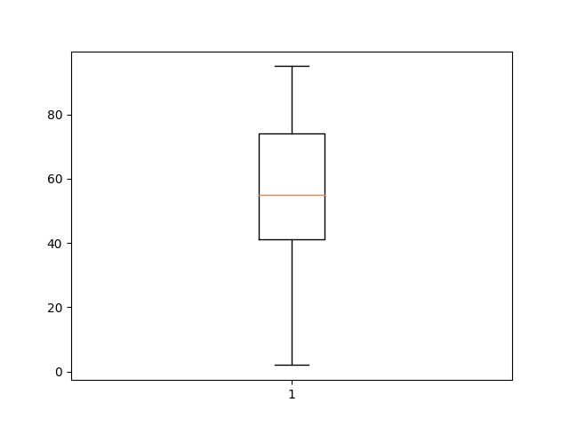

# About Box Plots

A ***box plot*** is a fancy graph that shows how a set of data is spread out.

As an example, consider this program:

<!--box.py-->
```python
import matplotlib.pyplot as plt

data = [2, 9, 22, 34, 39, 42, 43, 46, 53, 55, 55, 63, 67, 72, 74, 74, 78, 79, 87, 95]

plt.boxplot(data)

plt.savefig('box.png')
```

Here is the resulting plot:



The box in the middle shows the interquartile range, going from the first quartile (about 40 for this data set) at the
bottom to the third quartile (74) at the top. The line through the middle of the box shows the median.

The lines sticking out from the top and bottom of the box are sometimes called ***whiskers***. In this case, they
extend down to the minimum (2) and up to the maximum (95).

