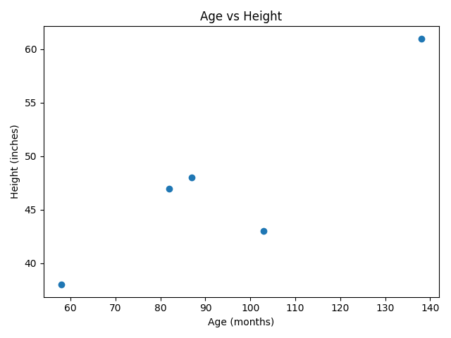

# Reading Data From a File

Real data, from science, polls, businesses, governments, etc., is generally not in the form of Python lists. Often,
it appears in a ***csv*** (comma-separated values) file, with a name ending in `.csv`. For example, here are the first
lines of the data from the National Center for Health Statistics mentioned previously:

```csv
age,weight,height,gender
58,38,38,M
103,87,43,M
87,50,48,M
138,98,61,M
82,47,47,F
```

You can think of this as a table, like you might see in a spreadsheet.

The first row gives the names of the columns, separated by commas. Each row after that gives a value for each column.

Python's `csv` library makes it relatively easy to extract any one column. If the information above is in a file
called `data.csv` (in the same folder as your Python program), then

```python
import csv

with open('data.csv') as file:
    reader = csv.DictReader(file)
    rows = [row for row in reader]
    ages = [int(row['age']) for row in rows]
    print(ages)
```

prints `[58, 103, 87, 138, 82]`.

(It was necessary to use `int` because the values read in by `csv` are strings.)

Here is a program to produce a scatter plot of age vs height:

<!--age_height.py-->
```python
import csv
import matplotlib.pyplot as plt

with open('data.csv') as file:
    reader = csv.DictReader(file)
    rows = [row for row in reader]
    ages = [int(row['age']) for row in rows]
    heights = [int(row['height']) for row in rows]

plt.scatter(ages, heights)

plt.title('Age vs Height')
plt.xlabel('Age (months)')
plt.ylabel('Height (inches)')

plt.tight_layout()
plt.show()
```

Here is the resulting image:


