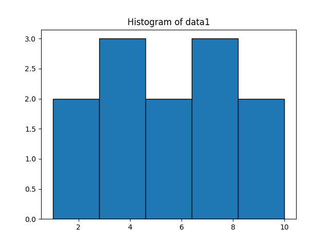
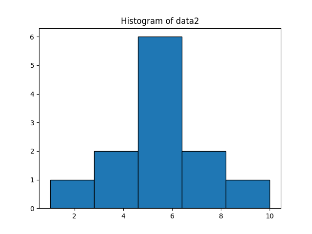
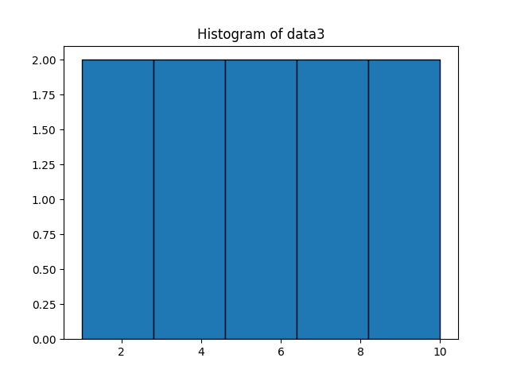
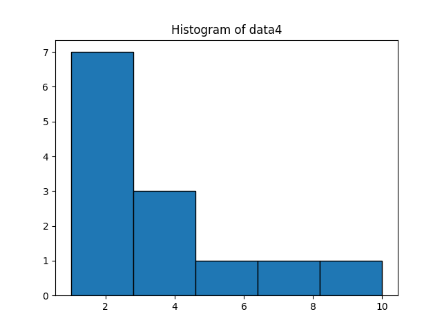
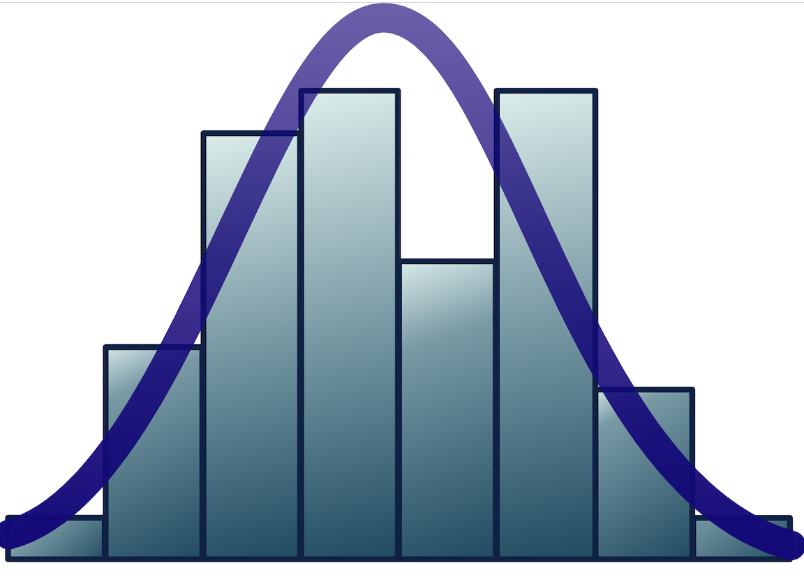

# The Distribution of a Set of Data

We have used measures of center (mean, median, and mode) and measures of spread (range, IQR, standard deviation) to describe a data set. So we can discuss the typical value of our data as well as how clumped or spread the data is.  However, these summaries still miss important aspects of a set of data.  For example, the data sets
```python
data1 = [1,2,3,3,4,5,6,7,8,8,9,10]

data2 = [1,3,3,5,5,5,6,6,6,7,7,10] 
```
both have median 5.5 and range 9.  But when we graph these data sets, we see that they have very different shapes.






Informally speaking, the distribution of a set of data is the shape the data makes when you plot it. We see that data sets ```data1``` and ```data2``` have the same median and range, but different distribtutions.

## Three Common Distributions

Some distributions of data are so common that they have been named and studied extensively.  There are many such distributions, three of which are given below.

* ***Uniform Distributions***
When each value in a data set is equally likely to occur, the data takes on a shape called a uniform distribution.  Below is an example of a uniformly distributed set of data.
```python
data3 = [1,2,3,4,5,6,7,8,9,10]
```

* ***Normal Distributions***
Here the data takes on a bell shape, with data values clustered near the mean and tapering off as you get far above or far below the mean.  This can occur when the quantity being measured is influenced by many independent things.  For example, the heights of corn plants in a field would likely be normally distributed.  There is variation in genetic tendencies to be tall versus short, and plants will be exposed to a range of sunlight, nutrients, and water.  The data in the list```data2``` above is normally distributed.
  

* ***Skewed Distributions***
A distribution is skewed when many data values fall on either the high or the low end of the range of data values, while relatively few data values appear at the other end of the range of values.  Data can be skewed in the presence of a positive feedback loop, for example. In this situation, the presence of one extreme outcome would encourage more outcomes at the same extreme, eventually yielding data that clusters at that extreme.  This happens when fruit on a tree ripens, for example.  The presence of one ripe fruit causes its neighbors to ripen, then their neighbors ripen and then all of a sudden all of the fruit on the tree is ripe.
The data in the list```data4``` plotted below are called ***skewed right*** because the thin tail of the plot is to the right.  When the thin tail of the plot is to the left, the data is called ***skewed left***.
  ```python
  data4 = [1,1,1,1,2,2,2,3,3,4,6,8,10]


 
## A More Official Version


More formally, a distribution is a mathematical function that models the shape of your data. In the image below, for example, the purple curve is graph of the mathematical function that models the shape of the histogram.  The purple curve is a ***normal distribution curve***.  These will be discussed more in Level IV.


