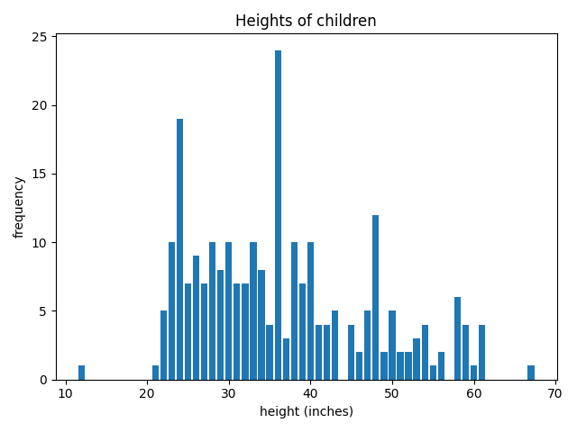

# Plotting a Frequency Bar Chart

Suppose you want to visualize how often different heights occur in the NCHS data. You could use a histogram, but
perhaps you don't want to group the heights into bins; you want to see how often each specific height occurs.

The raw data don't contain a list of the frequencies, but that's easily remedied:

<!--frequency.py-->
```python
import csv
import matplotlib.pyplot as plt

with open('nchs.csv') as file:
    reader = csv.DictReader(file)
    rows = [row for row in reader]

heights = [int(row['height']) for row in rows]

unique = list(set(heights))
counts = [heights.count(u) for u in unique]

plt.bar(unique, counts)

plt.ylabel('frequency')
plt.xlabel('height (inches)')
plt.title('Heights of children')

plt.tight_layout()
plt.show()
```

There are two challenges here. The first is to get a list of the unique heights. This is accomplished by the line

```python
unique = list(set(heights))
```

which converts `heights` into a `set` and then converts that `set` back into a `list`.

The second challenge is to find how often each of the unique heights occurs. This is accomplished by the line

```python
counts = [heights.count(u) for u in unique]
```

using a list comprehension.

Here is the resulting graph:


