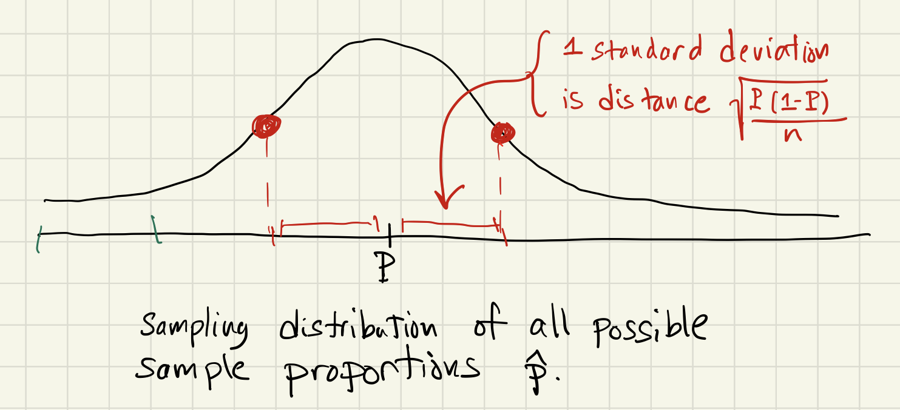

# The Central Limit Theorem

## The key ideas of this theorem (in words)
We have seen that as you take more and more samples, the distribution of sample proportions becomes closer and closer to a normal distribution. Also, if the parameter proportion for the entire populatin is P, the distribution of sample proportions has mean close to P. Finally, if we increase the size of the sample, the spread of the distribution of sample proportions decreases.

## The key ideas of this theorem (in pictures)

## The formal statement of the Central Limit Theorem

**The Central Limit Theorem:**  Suppose many simple random samples of size n are drawn from a population.  For each sample, a sample proportion  is recorded.  Let P denote the parameter proportion describing the whole population.  If nP and n(1-P) are both greater than 10, then the sampling distribution of all possible sample proportions  is *normally distributed*, *centered at P (so its mean is P)*, and has *standard deviation* given by the expression:

}{n}})

We illustrate the Central Limit Theorem with the image below, keeping in mind that the standard deviation of a normal curve can be visualized as the distance between the center of the curve and its points of inflection.  

