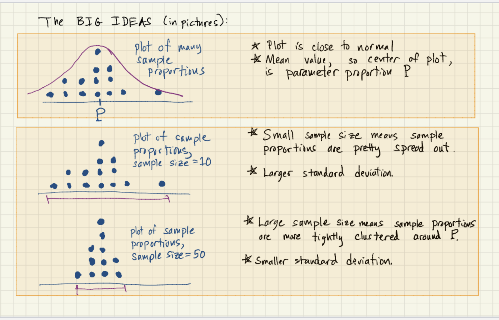

# The Central Limit Theorem

## The key ideas of this theorem (in words)
* We have seen that as you take more and more samples, the distribution of sample proportions becomes closer and closer to a normal distribution.
* Also, if the parameter proportion for the entire populatin is P, the distribution of sample proportions has mean close to P.
* Finally, if we increase the size of the sample, the spread of the distribution of sample proportions decreases.

## The key ideas of this theorem (in pictures)

