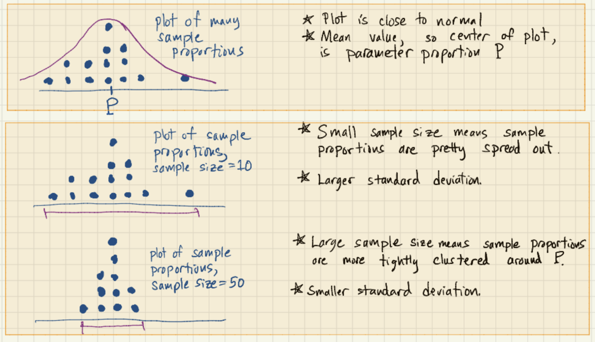
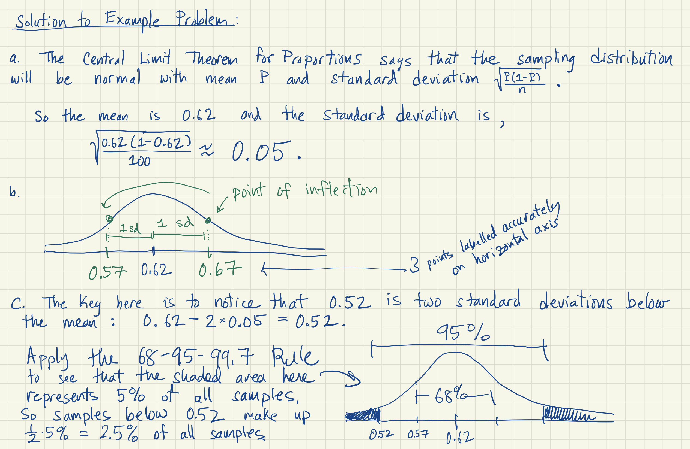

# The Central Limit Theorem

## The key ideas of this theorem (in words)
We have seen that as you take more and more samples, the distribution of sample proportions becomes closer and closer to a normal distribution. Also, if the parameter proportion for the entire populatin is P, the distribution of sample proportions has mean close to P. Finally, if we increase the size of the sample, the spread of the distribution of sample proportions decreases.

## The key ideas of this theorem (in pictures)

## The formal statement of the Central Limit Theorem

**The Central Limit Theorem:**  Suppose many simple random samples of size n are drawn from a population.  For each sample, a sample proportion  is recorded.  Let P denote the parameter proportion describing the whole population.  If nP and n(1-P) are both greater than 10, then the sampling distribution of all possible sample proportions  is *normally distributed*, *centered at P (so its mean is P)*, and has *standard deviation* given by the expression:

}{n}})

We illustrate the Central Limit Theorem with the image below, keeping in mind that the standard deviation of a normal curve can be visualized as the distance between the center of the curve and its points of inflection.  

## Exploration

The purpose of the practice problem below is to prepare you to understand how the Central Limit Theorem is used to define a 95% confidence interval. The problem is unrealistic because we assume we know the parameter proportion.  However it's a good middle step to get you to the much more practical idea of confidence intervals.

1. Suppose we happen to know 62% of Oregonians plan to vote for [Tan France](https://en.wikipedia.org/wiki/Tan_France) to be the new governor of Oregon.  (So we know the parameter proportion P is equal to 0.62.) Please answer the questions below:

  a. Use the Central Limit Theorem for Proportions to compute the mean and standard deviation of the sampling distribution of the proportion of France supporters in many, many simple random samples of 100 Oregonians.
  
  b. Draw a sketch of this sampling distribution by drawing a normal curve with the correct mean and standard deviation.  Scale the horizonal axis accordingly with the mean, and the numbers one standard deviation above and one standard deviation below the mean.
  
  c. From your work above, find the percent of 100 person simple randomm samples that have 52% or fewer France supporters.
  
  **Solution:** See the image below for the solution to Exploration problem #1.
  

