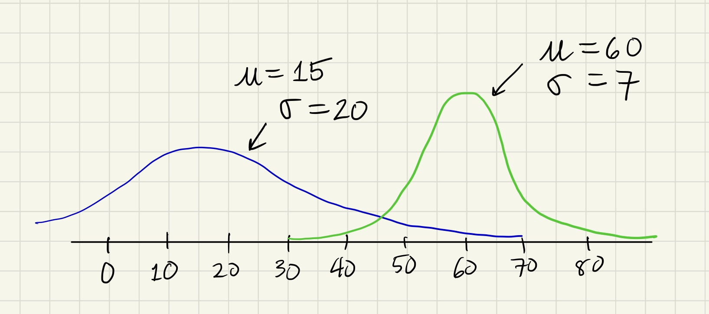

# More About Normal Distributions

## The Family of Normal Curves

Normal distributions are modeled by bell-shaped curves called ***normal curves***.  If your data is normally distributed with mean &mu; and standard deviation &sigma;, there is a specific normal curve that models your data.  In symbols, the corresponding normal curve is:

<blockquote>

</blockquote>

As seen in the figure below, different choices of mean &mu; and standard deviation &sigma; give normal curves with different shapes.  However both of these curves still belong to the family of normal curves.

## Identifying the Mean and Standard Deviation Associated to a Normal Curve

When examining the graph of a normal curve, you'll notice that the mean of the distribution occurs at the point on the horizontal axis that corresponds to the peak of the normal curve.  

You can also identify the standard deviation of a normal curve just by looking at the graph.  The trick is to find the ***points of inflection*** of the normal curve.  These are points where the curves switches from bending up like a smile to bending down like a frown.  When a piece of a graph is bending up like a smile, we say that part of the curve is ***concave up***.  When a piece of a graph is bending down like a frown, we say that part of the curve is ***concave down***.  The points of inflection are the poits where the curve switches its concavity.  A normal curve has exactly two points of inflection.  Each them have a horizontal coordinate that is exactly one standard deviation away from the mean.  The figure below illustrates these ideas.

## The Empirical Rule

Given a normal curve the observations above allow you to mark the mean on the horizontal axis of a normal curve, as well as points that are one standard deviation above and one standard deviation below the mean.  In fact we can also mark points two and three standard deviations above and below the mean.  In other words, there is a natural way to scale the horizontal axis of a normal curve.
