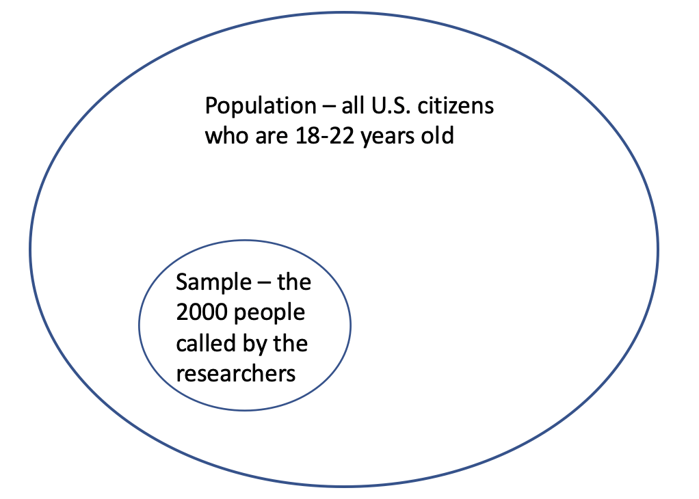

# Samples and Populations

An important application of statistics is to use a sample to understand some feature of a larger population.  This process is called ***statistical inference***.  It takes a few layers of theory to be able to do statistical inference.  The first step is to understand how the words ***populations***, ***parameters***, ***samples***, and ***statistics*** are used in statistics.  That is the focus of this page.

If you are rusty on the statistical terms *observational unit* and *variable* please re-read the [**Observational Units and Variables**](https://github.com/PeterDrake/liber_pythonis/blob/master/level_i/markdown/quant_cat.md) page in these notes.

# Definitions
* A ***population*** is the entire group of observational units of interest.
* A ***parameter*** is the value of a variable over an entire population.
* A ***sample*** is some subset of the population.
* A ***statistic*** is the value of a variable over a sample.

# Example
`A study seeks to understand the voting habits of U.S. citizens who are 18 to 22 years old.  Researchers call 2000 U.S. citzens in that age range and asks them if they voted in the most recent presidential election.`

In this example the population of interest is all U.S. citizens who are 18 to 22 years old.  The sample is the 2000 people called by the researchers.  The variable being studied is whether or not a person voted in the most recent presidential election. The parameter implied by this example is the proportion of all U.S. citizens of age 18 - 22 years who voted in the most recent presidential election.   The statistic implied by this example is the proportion of the 2000 people called by the researchers who voted in the most recent presidential election.

# Further notes

* *Parameters* describe *Populations*, and *Statistics* describe *Samples*.  **The letters match!**
* For large populations, parameters are unknowable.  It is impossible to get data from everyone in a population when the population is large. In contrast, statistics are easy to compute.  The hard part is building a sammple that successfully represents the population.

