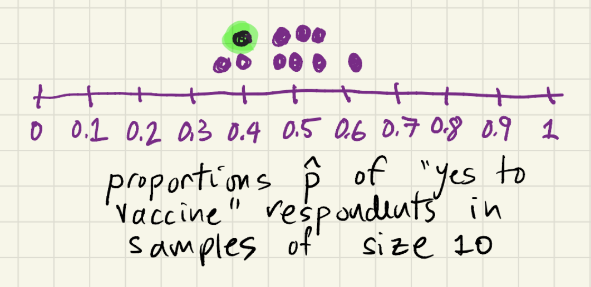
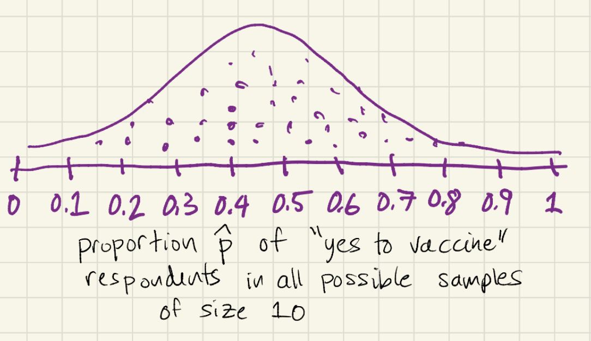

# What is a Sampling Distribution?

A ***sampling distribution*** is the *theoretical* distribution of all sample proportions computed for every possible simple random sample of a given size take from the population.

## Example of a Sampling Distribution

Let's first look at an example of an *almost* sampling distribution.

Suppose we would like to know what proportion of adults in the U.S. are definitely planning to get vaccinated against COVID, or have already been vaccinated.  So our population of interest is the roughly 250 million adults in the U.S.  By some miracle we collect ten perfect simple random samples of this population, each with 1000 voters, and record the proportion of adults in each sample that have been or will get the vaccine against COVID.  

Here are the results of the survey, which are completely made up:

| sample | # yes to vaccine | p^ = proportion saying yes to vaccine |
|--------|------------------|---------------------------------------|
| 1      | 555              | 0.555                                 |
| 2      | 492              | 0.492                                 |
| 3      | 570              | 0.570                                 |
| 4      | 399              | 0.399                                 |
| 5      | 622              | 0.622                                 |
| 6      | 501              | 0.501                                 |
| 7      | 412              | 0.412                                 |
| 8      | 380              | 0.380                                 |
| 9      | 524              | 0.524                                 |
| 10     | 475              | 0.475                                 |

We then make a dot plot of the proportions associated to each sample.  This plot is given below.  A single dot in this dot plot represents the proportion of people in one of the ten samples that responded they would definitely get or have already gotten a COVID vaccine.  For example, the dot highlighted in green represents the 0.412 in the proportion column of the table above.  Since each dot in the dot plot records a *sample proportion* we call this plot an *almost sampling distribution*.  For why *almost* is included, just keep reading.

To get an *actual* sampling distribution, imagine taking every possible simple random sample of 1000 from our population of 250 million adults in the U.S.  Record the proportion of people in each sample who either have been vaccinated or definitely plan to get vaccinated.  Then plot all of those sample proportions.  The distribution that you get is the actual sampling distribution.  The drawing below provides a visualization of this sampling distribution.

Key features of the example sampling distribution drawn above:
* the observational unit is a sample of 1000 voters,
* the variable being plotted is the sample proportion, p^, which is a statistic
* proportions are plotted for *all possible* samples.

## Further notes on sampling distributions in general

* A sampling distribution cannot actually ever be plotted as a dot plot -- we just can't take that many samples in practice.  But it can be described precisely using a statistics theorem called the "Central Limit Theorem."  
* Sampling distributions don't just work for sample proportions.  They work for all sorts of statistical measures.  Sampling distributions for means give us a statistical tool called a *t-test* that is used regularly in the sciences.  Something called the *F-statistic* has a sampling distribution that leads to a statistical tool called *Analysis of Variance (ANOVA)*.
* Sampling distributions are important because they are the heart of determining when a result is actually significant and not just due to random chance.
